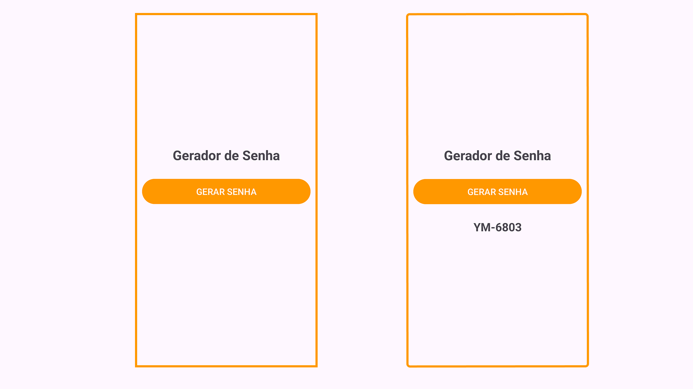

# 🔑 Gerador de Senhas em Kotlin   

## 📌 Sobre o Projeto  
O **Gerador de Senhas em Kotlin** é um aplicativo simples e funcional desenvolvido para dispositivos Android.  
O objetivo do app é gerar senhas aleatórias combinando **duas letras maiúsculas** e um **número de quatro dígitos**, no formato `AB-1234`.  

Esse projeto foi criado para praticar **desenvolvimento Android com Kotlin**, utilizando **ViewBinding** para manipulação dos elementos da interface e explorando a geração de valores aleatórios na linguagem.  

## 🖼️ Capturas de Tela  

 

## 🚀 Tecnologias Utilizadas  
- **Kotlin**  
- **Android Studio**  
- **ViewBinding**  
